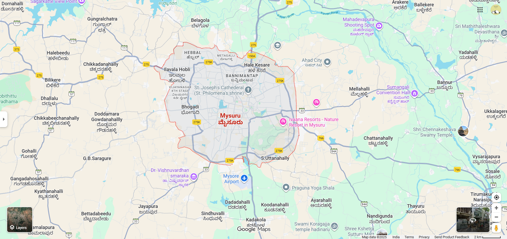
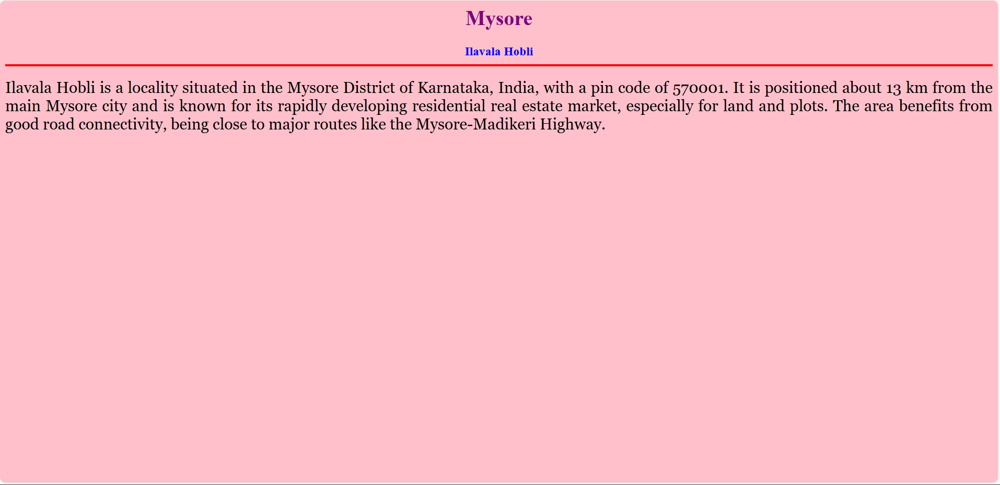
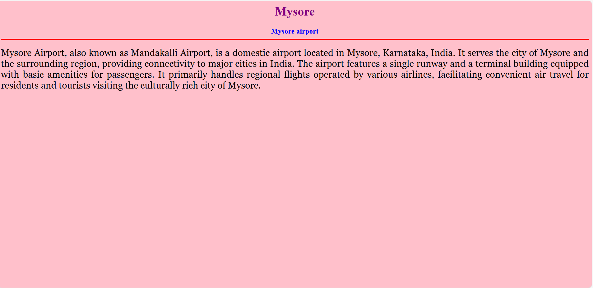

# Ex04 Places Around Me
## Date: 26.10.2025

## AIM
To develop a website to display details about the places around my house.

## DESIGN STEPS

### STEP 1
Create a Django admin interface.

### STEP 2
Download your city map from Google.

### STEP 3
Using ```<map>``` tag name the map.

### STEP 4
Create clickable regions in the image using ```<area>``` tag.

### STEP 5
Write HTML programs for all the regions identified.

### STEP 6
Execute the programs and publish them.

## CODE
```
map.html

<html>
    <head>
        <title>My City</title>
    </head>
    <body>
        <h1 align="center">
            <font color="red"><b>MYSORE</b></font>
        </h1>
        <h3 align="center">
            <font color="blue"><b>Shasmithaa Sankar (212224040311)</b></font>
        </h3>
        <center>


<map name="image-map">
    <area target="" alt="Ilavala Hobli" title="Ilavala Hobli" href="Ilavala Hobli.html" coords="614,256,729,327" shape="rect">
    <area target="" alt="Hale Kesare" title="Hale Kesare" href="Hale Kesare.html" coords="910,224,1034,281" shape="rect">
    <area target="" alt="Ivaana Resorts" title="Ivaana Resorts" href="Ivaana resorts.html" coords="1044,421,1299,494" shape="rect">
    <area target="" alt="Vishnuvardhan smaraka" title="Vishnuvardhan smaraka" href="vishnuvardhan smaraka.html" coords="533,617,777,724" shape="rect">
    <area target="" alt="Mysore airport" title="Mysore airport" href="airport.html" coords="817,636,973,712" shape="rect">
</map>

             
        </center>
    </body>
</html>

Ilavala Hobli.html

<html>
    <head>
        <title>My hometown</title>
    </head>
    <body bgcolor="pink">
        <h1 align="center">
            <font color="purple"><b>Mysore</b></font>
        </h1>
        <h3 align="center">
            <font color="blue"><b>Ilavala Hobli</b></font>
            <hr size="3" color="red">
        </h3>
        <p align="justify">
            <font face="Georgia" size="5">
                Ilavala Hobli is a locality situated in the Mysore District of Karnataka, India, with a pin code of 570001. 
                It is positioned about 13 km from the main Mysore city and is known for its rapidly developing residential real estate market, especially for land and plots. 
                The area benefits from good road connectivity, being close to major routes like the Mysore-Madikeri Highway.
            </font>
        </p>
    </body>
</html>

Hale Kesare.html

<html>
    <head>
        <title>My hometown</title>
    </head>
    <body bgcolor="pink">
        <h1 align="center">
            <font color="purple"><b>Mysore</b></font>
        </h1>
        <h3 align="center">
            <font color="blue"><b>Hale Kesare</b></font>
            <hr size="3" color="red">
        </h3>
        <p align="justify">
            <font face="Georgia" size="5">
                Hale Kesare is a small village located in the Mysore District of Karnataka, India.
                It's situated immediately north of the Ring Road and near the R.S. Naidu Nagar satellite bus station, making it a well-connected area to the main city.
                The village is part of the developing residential landscape in Mysore, though it has also been associated with the location of a Solid Waste Treatment and Recycling Plant which has been a point of concern for residents regarding pollution.
            </font>
            
        </p>
    </body>
</html>

Ivaana resort.html

<html>
    <head>
        <title>My hometown</title>
    </head>
    <body bgcolor="pink">
        <h1 align="center">
            <font color="purple"><b>Mysore</b></font>
        </h1>
        <h3 align="center">
            <font color="blue"><b>Ivaana Resorts</b></font>
            <hr size="3" color="red">
        </h3>
        <p align="justify">
            <font face="Georgia" size="5">
                Ivaana Resorts is a luxurious resort located in Mysore, Karnataka, India. 
                It offers a blend of modern amenities and traditional hospitality, making it a popular choice for tourists and business travelers alike. 
                The resort features well-appointed rooms, conference facilities, a spa, and various dining options, providing guests with a comfortable and enjoyable stay.
            </font>
            
        </p>
    </body>
</html>

vishnuvardhan smaraka.html

<html>
    <head>
        <title>My hometown</title>
    </head>
    <body bgcolor="pink">
        <h1 align="center">
            <font color="purple"><b>Mysore</b></font>
        </h1>
        <h3 align="center">
            <font color="blue"><b>Vishnuvardhan Smaraka</b></font>
            <hr size="3" color="red">
        </h3>
        <p align="justify">
            <font face="Georgia" size="5">
                The Vishnuvardhan Smaraka is a memorial dedicated to the legendary Kannada actor Vishnuvardhan, located in Mysore, Karnataka, India. 
                This memorial honors his immense contribution to Kannada cinema and his lasting legacy in the hearts of his fans. 
                The site often features statues, plaques, and exhibits that celebrate his life and work, making it a significant cultural landmark in Mysore.
            </font>
            
        </p>
    </body>
</html>

airports.html

<html>
    <head>
        <title>My hometown</title>
    </head>
    <body bgcolor="pink">
        <h1 align="center">
            <font color="purple"><b>Mysore</b></font>
        </h1>
        <h3 align="center">
            <font color="blue"><b>Mysore airport</b></font>
            <hr size="3" color="red">
        </h3>
        <p align="justify">
            <font face="Georgia" size="5">
                Mysore Airport, also known as Mandakalli Airport, is a domestic airport located in Mysore, Karnataka, India. 
                It serves the city of Mysore and the surrounding region, providing connectivity to major cities in India. 
                The airport features a single runway and a terminal building equipped with basic amenities for passengers. 
                It primarily handles regional flights operated by various airlines, facilitating convenient air travel for residents and tourists visiting the culturally rich city of Mysore.
            </font>
            
        </p>
    </body>
</html>
```


## OUTPUT







## RESULT
The program for implementing image maps using HTML is executed successfully.
